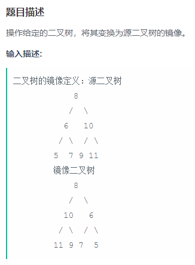

    

	package offer;
	
	/*
	 * 题目 ：二叉树的镜像（157页）
	 * 
	 * 操作给定的二叉树，将其变换为源二叉树的镜像。
	 *
	 */
	public class A22_Mirror_image_of_a_binary_tree {
		public class TreeNode {
			int val = 0;
			TreeNode left = null;
			TreeNode right = null;
	
			public TreeNode(int val) {
				this.val = val;
			}
		}
	
		public void Mirror(TreeNode root) {
			if (root == null) {
				return;
			}
			if (root.left == null && root.right == null) {
				return;
			}
			TreeNode pTemp = root.left;
			root.left = root.right;
			root.right = pTemp;
	
			if (root.left != null) {
				Mirror(root.left);
			}
			if (root.right != null) {
				Mirror(root.right);
			}
		}
	}
